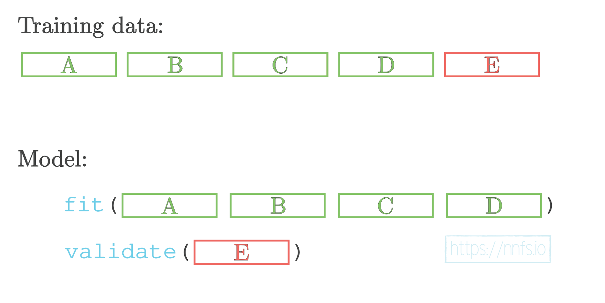
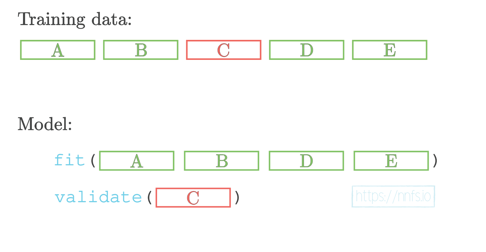

# Validation Data

When using a validation dataset and cross-validation, it is common to loop over different
hyperparameter sets, leaving the code to run training multiple times, applying different settings
each run, and reviewing the results to choose the best set of hyperparameters. In general, we
should not loop over all possible setting combinations that we would like to check unless training
is exceptionally fast. It’s usually better to check some settings that we suspect will work well, pick
the best combination of those settings, tweak them to create the next list of setting sets, and train
the model on new sets. We can repeat this process as many times as we’d like.

